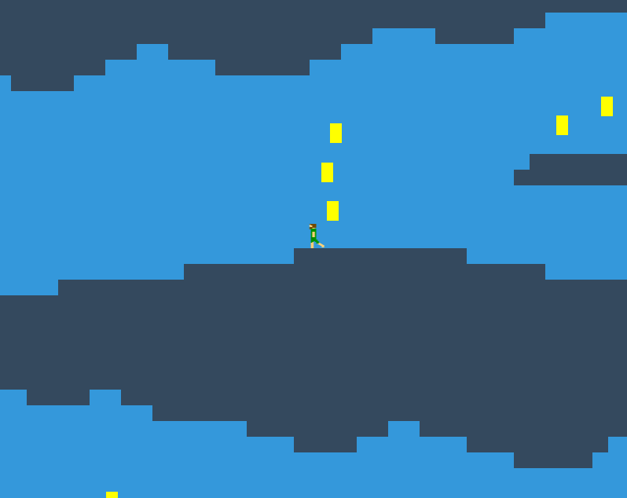

#Awesome Platform Game

HTML5 platform game about a caveman and his love of shiny rocks

##Dev Installation

1. Install the following:
  1. [Git](http://git-scm.com/)
  2. [Node/NPM](http://nodejs.org/)
  3. [Grunt](http://gruntjs.com/getting-started) (npm install -g grunt-cli)
  3. Ruby [Windows installer](http://rubyinstaller.org/downloads/)
  4. [Sass](http://sass-lang.com/) (gem install sass)
1. Clone this repo
2. Run `npm install` in the root folder

##Usage

1. `grunt` - runs a static server on port 9000 and auto-refreshes when a change is made to a CSS, JS, HTML or image file.
Also compiles SASS files - config set in the Gruntfile. Stop the server with Ctrl+C.

Tilemaps in /app/assets are generated using Tiled